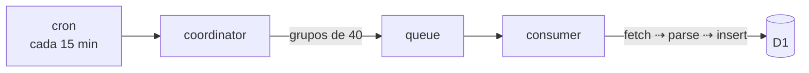

# RSS para físicxs

[](https://github.com/caefisica/news-reader/actions/workflows/deploy.yml)

RSS para físicxs reúne becas, convocatorias, eventos y oportunidades académicas
para estudiantes e investigadores de física en Perú. El proyecto consume feeds
RSS y Atom de universidades, revistas, blogs institucionales y portales
públicos, normaliza los artículos y los sirve desde una interfaz web simple.



Un cron ejecuta el `coordinator` cada 15 minutos. Este worker lee las fuentes
activas desde D1 y las envía a una cola en grupos de 40. El `consumer` escucha
la cola y procesa las fuentes en paralelo.

Cada fuente sigue este flujo:

```text
fetch XML ⇢ parse ⇢ normalización ⇢ INSERT OR IGNORE
```

Los feeds se parsean sin dependencias externas. Cada fuente define su parser en
la base de datos. Actualmente existen parsers para feeds estándar, Blogger y
algunos feeds inconsistentes de `gob.pe`.

El frontend usa Nuxt 4 sobre Cloudflare Workers (`cloudflare_module`). Las rutas
`/api/articles` y `/api/sources` leen datos desde D1 y los sirven al cliente.

## Desarrollo local

```sh
git clone https://github.com/caefisica/rss-reader.git
cd rss-reader

bun install
bun run migrate:local
bun run dev
```

Para ejecutar la ingesta localmente:

```sh
bun run ingest
```

Cada worker tiene su propio `wrangler.toml`. El `wrangler.json` raíz configura
los bindings compartidos de D1 y la cola.
